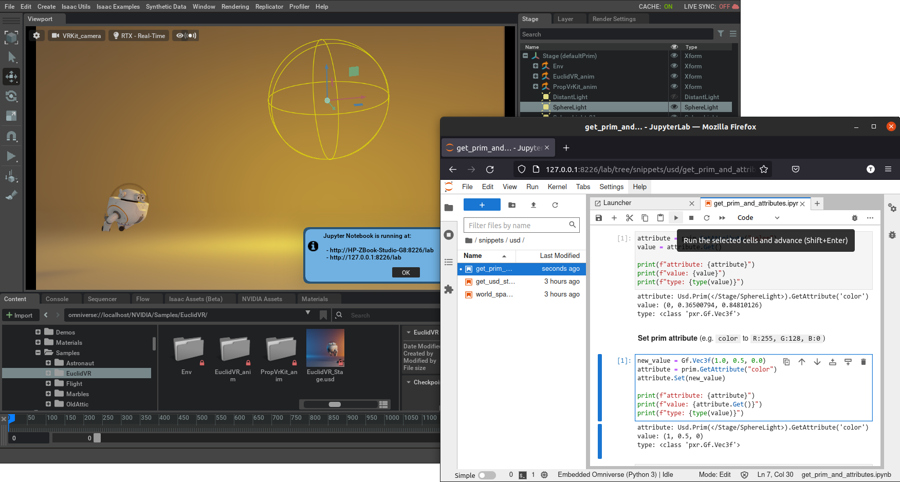
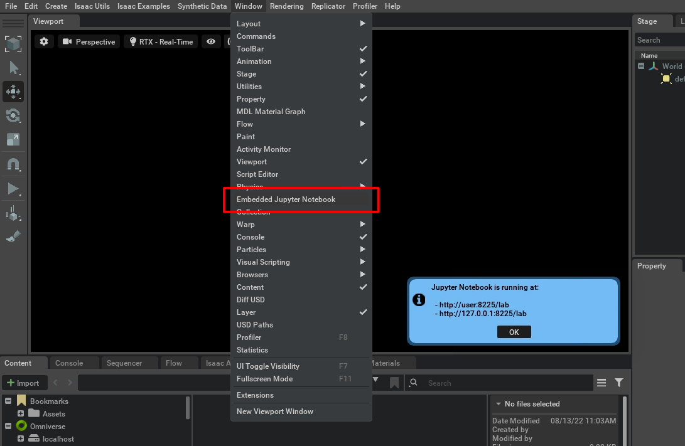

## Embedded Jupyter Notebook for NVIDIA Omniverse

> This extension can be described as the [Jupyter](https://jupyter.org/) notebook version of Omniverse's [Script Editor](https://docs.omniverse.nvidia.com/prod_extensions/prod_extensions/ext_script-editor.html). It allows to open a Jupyter Notebook embedded in the current NVIDIA Omniverse application scope

<br>

**Target applications:** Any NVIDIA Omniverse app

**Supported OS:** Windows and Linux

**Changelog:** [CHANGELOG.md](exts/semu.misc.jupyter_notebook/docs/CHANGELOG.md)

**Table of Contents:**

- [Extension setup](#setup)
- [Extension usage](#usage)
- [Configuring the extension](#config)
- [Implementation details](#implementation)

<br>



<hr>

<a name="setup"></a>
### Extension setup

1. Add the extension using the [Extension Manager](https://docs.omniverse.nvidia.com/prod_extensions/prod_extensions/ext_extension-manager.html) or by following the steps in [Extension Search Paths](https://docs.omniverse.nvidia.com/py/kit/docs/guide/extensions.html#extension-search-paths)

    * Git url (git+https) as extension search path

        :warning: *There seems to be a bug when installing extensions using the git url (git+https) as extension search path in some Omniverse applications. In this case, it is recommended to install the extension by importing the .zip file*
    
        ```
        git+https://github.com/Toni-SM/semu.misc.jupyter_notebook.git?branch=main&dir=exts
        ```

    * Compressed (.zip) file for import

        [semu.misc.jupyter_notebook.zip](https://github.com/Toni-SM/semu.misc.jupyter_notebook/releases)

2. Enable the extension using the [Extension Manager](https://docs.omniverse.nvidia.com/prod_extensions/prod_extensions/ext_extension-manager.html) or by following the steps in [Extension Enabling/Disabling](https://docs.omniverse.nvidia.com/py/kit/docs/guide/extensions.html#extension-enabling-disabling)

<hr>

<a name="usage"></a>
### Extension usage

#### Omniverse app

Enabling the extension launches the Jupyter Notebook server ([JupyterLab](https://jupyterlab.readthedocs.io/en/stable/) or [Jupyter Notebook](https://jupyter-notebook.readthedocs.io/en/latest/)) in the background. The notebook can then be opened in the browser via its URL (`http://WORKSTATION_IP:PORT/`), which is also indicated inside the Omniverse application in the *Windows > Embedded Jupyter Notebook* menu.

> **Note:** The Jupyter Notebook URL port may change if the configured port is already in use.

<br>
<p align="center">
  
</p>

Disabling the extension shutdowns the Jupyter Notebook server and the openened kernels.

#### Jupyter Notebook

To execute Python code in the current NVIDIA Omniverse application scope use the following kernel: 

<br>
<table align="center" class="table table-striped table-bordered">
  <thead>
  </thead>
  <tbody>
    <tr>
      <td>Embedded Omniverse (Python 3)</td>
      <td><p align="center" style="margin: 0"></p></td>
    </tr>
  </tbody>
</table>

##### Code autocompletion

Use the <kbd>Tab</kbd> key for code autocompletion.

##### Code introspection 

Use the <kbd>Ctrl</kbd> + <kbd>i</kbd> keys for code introspection (display *docstring* if available).

<hr>

<a name="config"></a>
### Configuring the extension

The extension can be configured by editing the [config.toml](exts/semu.misc.jupyter_notebook/config/extension.toml) file under `[settings]` section. The following parameters are available:

<br>

**Extension settings**

<table class="table table-striped table-bordered">
  <thead>
    <tr>
      <th>Parameter</th>
      <th>Value</th>
      <th>Description</th>
    </tr>
  </thead>
  <tbody>
    <tr>
      <td>socket_port</td>
      <td>8224</td>
      <td>The port on which the Jupyter Notebook server will be listening for connections</td>
    </tr>
    <tr>
      <td>classic_notebook_interface</td>
      <td>false</td>
      <td>Whether the Jupyter Notebook server will use the JupyterLab interface (default interface) or the classic Jupyter Notebook interface</td>
    </tr>
    <tr>
      <td>kill_processes_with_port_in_use</td>
      <td>true</td>
      <td>Whether to kill applications/processes that use the same ports (8224 and 8225 by default) before activating the extension. Disable this option if you want to launch multiple applications that have this extension active</td>
    </tr>
  </tbody>
</table>

<br>

**Jupyter Notebook server settings**

<table class="table table-striped table-bordered">
  <thead>
    <tr>
      <th>Parameter</th>
      <th>Value</th>
      <th>Description</th>
    </tr>
  </thead>
  <tbody>
    <tr>
      <td>notebook_ip</td>
      <td>"0.0.0.0"</td>
      <td>The IP address on which the Jupyter Notebook server will be launched</td>
    </tr>
    <tr>
      <td>notebook_port</td>
      <td>8225</td>
      <td>The port on which the Jupyter Notebook server will be launched. If the port is already in use, the server will be launched on a different incrementing port</td>
    </tr>
    <tr>
      <td>token</td>
      <td>""</td>
      <td>The Jupyter Notebook server token. If empty, the default configuration, the server will be launched without authentication</td>
    </tr>
    <tr>
      <td>notebook_dir</td>
      <td>""</td>
      <td>The Jupyter Notebook server directory</td>
    </tr>
    <tr>
      <td>command_line_options</td>
      <td>"--allow-root --no-browser"</td>
      <td>The Jupyter Notebook server command line options excluding the previously mentioned parameters</td>
    </tr>
  </tbody>
</table>

<hr>

<a name="implementation"></a>
### Implementation details

Both the Jupyter Notebook server and the IPython kernels are designed to be launched as independent processes (or subprocesses). Due to this specification, the Jupyter Notebook server and the IPython kernels are launched in separate (sub)processes.

<br>
<table class="table table-striped table-bordered">
  <thead>
    <tr>
      <th></th>
      <th>Jupyter Notebook as (sub)process</th>
    </tr>
  </thead>
  <tbody>
    <tr>
      <td>Kernel (display name)</td>
      <td>Embedded Omniverse (Python 3)</td>
    </tr>
    <tr>
      <td>Kernel (logo)</td>
      <td><p align="center"></p></td>
    </tr>
    <tr>
      <td>Kernel (raw name)</td>
      <td>embedded_omniverse_python3_socket</td>
    </tr>
    <tr>
      <td>Instanceable kernels</td>
      <td>Unlimited</td>
    </tr>
    <tr>
      <td>Python backend</td>
      <td>Omniverse Kit embedded Python</td>
    </tr>
    <tr>
      <td>Code execution</td>
      <td>Intercept Jupyter-IPython communication, forward and execute code in Omniverse Kit and send back the results to the published by the notebook</td>
    </tr>
    <tr>
      <td>Main limitations</td>
      <td>
        <ul>
          <li>IPython magic commands are not available</li>
          <li>Printing, inside callbacks, is not displayed in the notebook but in the Omniverse terminal</li>
          <li>Matplotlib plotting is not available in notebooks</li>
        </ul>
      </td>
    </tr>
  </tbody>
</table>
